Basic Machine Learning dengan Decision Tree, Random Forest, Naive Bayes,
dan Support Vector Machine (SVM)
================
Mely Santoso
Last compiled on 14 March, 2022

# Pendahuluan

Dalam tutorial ini kita akan mengunakan data set *iris* untuk membuat
panduan bagi pemula untuk mempelajari 4 **supervised machine learning
classification models** dengan tujuan untuk memprediksi dengan cara
klasifikasi iris species berdasarkan set variabels.

Kita akan mempelajari:

  - **Decision Trees**
  - **Random Forests**
  - **Naive Bayes**
  - **Support Vector Machines (SVM)**

Membuat pemodelan machine learning biasanya meliputi proses berikut:

1.  *Exploratory data analysis* - proses eksplorasi data untuk menemukan
    pola penting dan untuk membantu feature enginering
2.  *Feature engineering* - membuat variabel baru dari variabel yang
    sudah ada
3.  *Menangani missing value* - menentukan akan diapakan nilai kosong
    (missing value) dalam data
4.  *Machine learning* - membuat pemodelan prediktif
5.  *Prediction* - menggunakan machine learning model untuk prediksi

Biasanya, proses 1-3 membutuhkan waktu yang cukup banyak. Berbeda dengan
membuat pemodelan yang hanya membutuhkan sedikit waktu jika data yang
didapatkan sudah cukup baik. Untuk kali ini, kita tidak akan membahas
poin kedua dan ketiga. Namun demikian, perlu dicatat proses 2 dan 3 ini
sangatlah penting dalam menghadapi permasalahan data di industri pada
umumnya.

## Load packages yang dibutuhkan

Pertama, kita harus memuat seluruh packages yang kita gunakan untuk
memudahkan proses penulisan kode.

``` r
library(tidyverse) # EDA dan visualisasi data dengan ggplot2
library(plotly) # Visualisasi data interaktif
library(psych) # Visualisasi korelasi 
library(klaR) # Naive Bayes 
library(rattle) # Grafik decision tree 
library(caret) # Machine learning 
library(randomForest) # Random Forest 
library(scatterplot3d)
library(party)
```

Memuat data set iris. Karena data set ini merupakan data built-in di
*R*, maka kita tidak perlu memasukkannya dari luar.

``` r
data("iris")
```

## Selayang pandang data iris

Mari kita check head dari data begitu juga ringkasan data untuk mendapat
feel dari datanya

### Head

``` r
head(iris)
```

    ##   Sepal.Length Sepal.Width Petal.Length Petal.Width Species
    ## 1          5.1         3.5          1.4         0.2  setosa
    ## 2          4.9         3.0          1.4         0.2  setosa
    ## 3          4.7         3.2          1.3         0.2  setosa
    ## 4          4.6         3.1          1.5         0.2  setosa
    ## 5          5.0         3.6          1.4         0.2  setosa
    ## 6          5.4         3.9          1.7         0.4  setosa

### Glimpse

``` r
glimpse(iris)
```

    ## Rows: 150
    ## Columns: 5
    ## $ Sepal.Length <dbl> 5.1, 4.9, 4.7, 4.6, 5.0, 5.4, 4.6, 5.0, 4.4, 4.9, 5.4,...
    ## $ Sepal.Width  <dbl> 3.5, 3.0, 3.2, 3.1, 3.6, 3.9, 3.4, 3.4, 2.9, 3.1, 3.7,...
    ## $ Petal.Length <dbl> 1.4, 1.4, 1.3, 1.5, 1.4, 1.7, 1.4, 1.5, 1.4, 1.5, 1.5,...
    ## $ Petal.Width  <dbl> 0.2, 0.2, 0.2, 0.2, 0.2, 0.4, 0.3, 0.2, 0.2, 0.1, 0.2,...
    ## $ Species      <fct> setosa, setosa, setosa, setosa, setosa, setosa, setosa...

### Attributes

``` r
attributes(iris)
```

    ## $names
    ## [1] "Sepal.Length" "Sepal.Width"  "Petal.Length" "Petal.Width"  "Species"     
    ## 
    ## $class
    ## [1] "data.frame"
    ## 
    ## $row.names
    ##   [1]   1   2   3   4   5   6   7   8   9  10  11  12  13  14  15  16  17  18
    ##  [19]  19  20  21  22  23  24  25  26  27  28  29  30  31  32  33  34  35  36
    ##  [37]  37  38  39  40  41  42  43  44  45  46  47  48  49  50  51  52  53  54
    ##  [55]  55  56  57  58  59  60  61  62  63  64  65  66  67  68  69  70  71  72
    ##  [73]  73  74  75  76  77  78  79  80  81  82  83  84  85  86  87  88  89  90
    ##  [91]  91  92  93  94  95  96  97  98  99 100 101 102 103 104 105 106 107 108
    ## [109] 109 110 111 112 113 114 115 116 117 118 119 120 121 122 123 124 125 126
    ## [127] 127 128 129 130 131 132 133 134 135 136 137 138 139 140 141 142 143 144
    ## [145] 145 146 147 148 149 150

Data iris memiliki 4 variable dengan tipe data dbl yang berarti angka
desimal meliputi variable Sepal.Length, Sepal.Width, Petal.Length, dan
Petal.Width. Variable Species merupakan factor.

<br>

# Exploratory Data Analysis

Mari membuat exploratory data analysis (EDA) untuk menginvesitgasi
secara visual, menemukan pola, dan insight dari data. Langkah ini dapat
membantuk kita untuk memahami dan persiapan membuat model. Pada bagian
ini, data akan kita eksplorasi menggunakan dua cara; pertama dengan
melihat angka-angka dengan sebagian menggunakan visualisasi basic R dan
yang kedua dengan melihat angka-angka tersebut dalam visualisasi
menggunakan ggplot2 library.

## Exploring numeral variable

Angka distribusi dari masing-masing variabel dapat dilihat menggunakan
fungsi summary yang akan menunjukkan nilai maksimum, minimum, mean,
median, dan kuartal pertama (25%) dan kuartal ke-tiga (75%).

``` r
summary(iris)
```

    ##   Sepal.Length    Sepal.Width     Petal.Length    Petal.Width   
    ##  Min.   :4.300   Min.   :2.000   Min.   :1.000   Min.   :0.100  
    ##  1st Qu.:5.100   1st Qu.:2.800   1st Qu.:1.600   1st Qu.:0.300  
    ##  Median :5.800   Median :3.000   Median :4.350   Median :1.300  
    ##  Mean   :5.843   Mean   :3.057   Mean   :3.758   Mean   :1.199  
    ##  3rd Qu.:6.400   3rd Qu.:3.300   3rd Qu.:5.100   3rd Qu.:1.800  
    ##  Max.   :7.900   Max.   :4.400   Max.   :6.900   Max.   :2.500  
    ##        Species  
    ##  setosa    :50  
    ##  versicolor:50  
    ##  virginica :50  
    ##                 
    ##                 
    ## 

Coba perhatikan ke variable Sepal.Length sebagai contoh. Hasil di atas
menunjukkan bahwa Sepal.Length memiliki nilai minimum 4.3 dan nilai
maksimum 7.9. Nilai kuartal pertamanya (1st Qu) adalah 5.1; menunjukkan
bahwa bahwa 25% dari data iris memiliki Sepal.Length di bawah angka 5.1.
Begitu juga dengan nilai kuartal ketiga (3rd Qu) mengindikasikan bahwa
75% dari spesies yang tercatat memiliki ukuran Sepal.Length di bawah
6.4.

Dari hasil summary di atas juga kita dapat melihat bahwa variabel
Sepal.Length memiliki nilai media 5.8 dan mean atau nilai rata-rata 5.8.
Interpretasi yang sama berlaku juga untuk tiga variabel dengan tipe data
dbl lainnya.

Kita juga sebenarnya dapat mengeksplorasi nilai-nilai tersebut dengan
menggunakan funsgi basik yang ada di `R` seperti mean(), median(), dan
range(). Dengan fungsi quantile() kita bisa melihat nilai kuartil dan
persentil dari variabel.

``` r
quantile(iris$Sepal.Length)
```

    ##   0%  25%  50%  75% 100% 
    ##  4.3  5.1  5.8  6.4  7.9

``` r
quantile(iris$Sepal.Length, c(0.1, 0.3, 0.65))
```

    ##  10%  30%  65% 
    ## 4.80 5.27 6.20

Selanjutnya, kita juga bisa memeriksa variance dari Sepal.Length
menggunakan var() command, dan menggunakan visualisasi dasar `R` dengan
hist() dan density() command untuk memeriksa distribusinnya dengan
memasukkannya pada plot()
command.

``` r
var(iris$Sepal.Length)
```

    ## [1] 0.6856935

``` r
hist(iris$Sepal.Length)
```

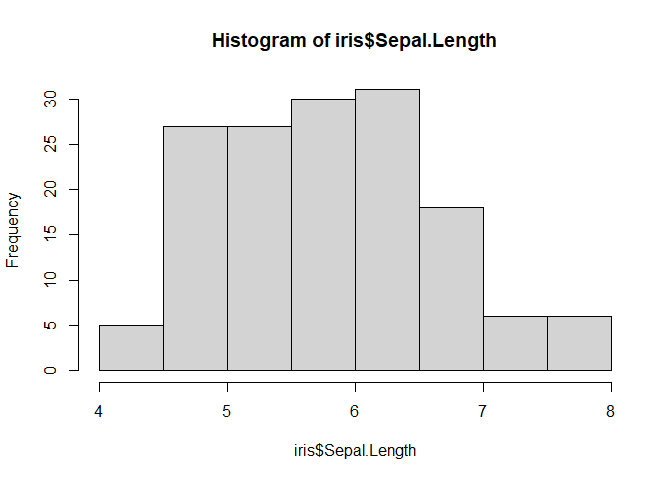

``` r
plot(density(iris$Sepal.Length))
```

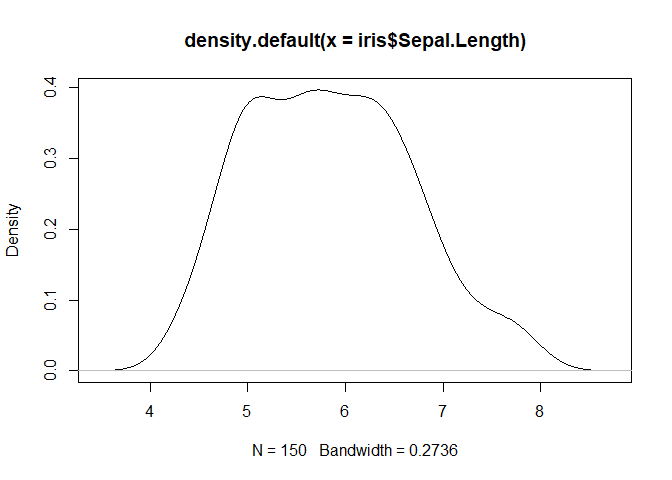

Bagaimana dengan variable Species?

Variabel Species ini bukanlah angka melainkan string dengan tipe data
factor. Pada tabel summary di atas, kita melihat jumlah dari
masing-masing spesies adalah 50. Kita akan menggunakan fungsi table()
untuk melihat jumlahnya, dan menggunakan funsgi plot pie() dan barplot()
untuk visualisasinya.

``` r
table(iris$Species)
```

    ## 
    ##     setosa versicolor  virginica 
    ##         50         50         50

``` r
pie(table(iris$Species))
```

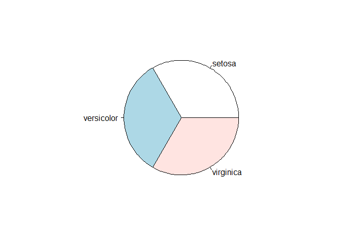

``` r
barplot(table(iris$Species))
```

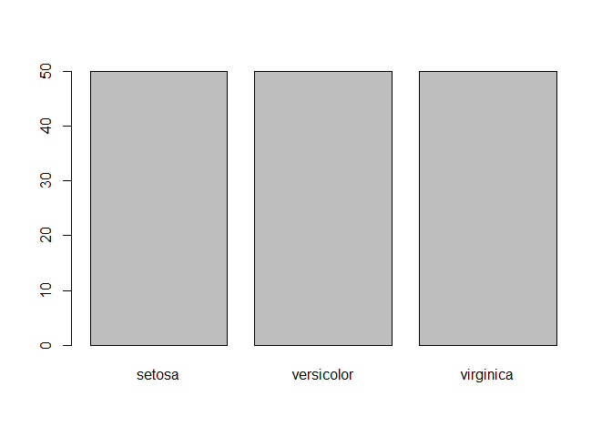

## Visualization exploration

### Correlation matrix

Sekarang, kita akan membuat matrix korelasi menggunakan fungsi
`pairs.panles()` dari package PSYCH untuk melihat bagaimana variabel
dari data berkorelasi

``` r
pairs.panels(
  iris[,1:4],
  scale = TRUE,
  hist.col = 'grey85',
  bg = c("mediumseagreen", "orange2", "mediumpurple1")[iris$Species],
  pch = 21,
  main = "Correlation matrix dari data Iris"
)
```

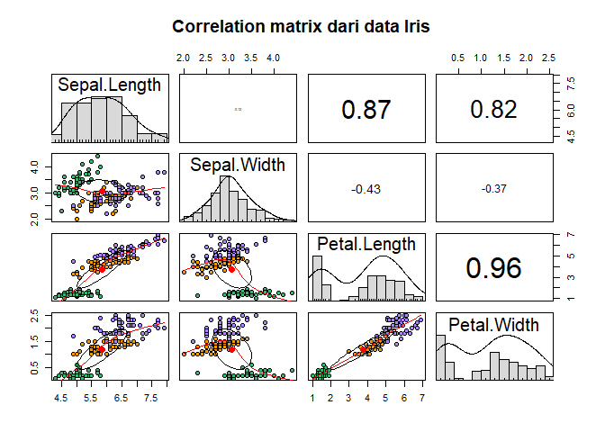

Bagian atas dari matrix korelasi ini menunjukkan nilai hubungan atau
korelasi antar variabel. Kita juga dapat melihat bahwa nilai korelasi
antar semua variabel berentang antara moderate dan kuat kecuali untuk
variabel *sepal length* dan *sepal width*. Jika kita melihat bagian
bawah dari matrix korelasi, kita akan dimanjakan dengan visualisasi
scatter plot dari nilai korelasi yang dibedakan dari species menggunakan
warna. Ini memungkinkan kita untuk melihat seluruh clusters yang ada
antar spesies.

<br>

### 3D Plot

Kita akan membuat visualisasi 3 dimensi statis dari dataset iris.

Karena 3D plot adalah 3 dimensi, maka kita hanya dapat memasukkan 3
variabel dalam axes yang ada (x, y, z). Karena secara keseluruhan kita
memiliki 4 variabel dengan tipe data dbl, 1 variabel dikeluarkan agar
bisa membuat 3D plot. Variabel sepal width akan dikeluarkan jika melihat
variabel secara individu
.

``` r
scatterplot3d::scatterplot3d(iris$Petal.Length, iris$Petal.Length, iris$Petal.Length)
```

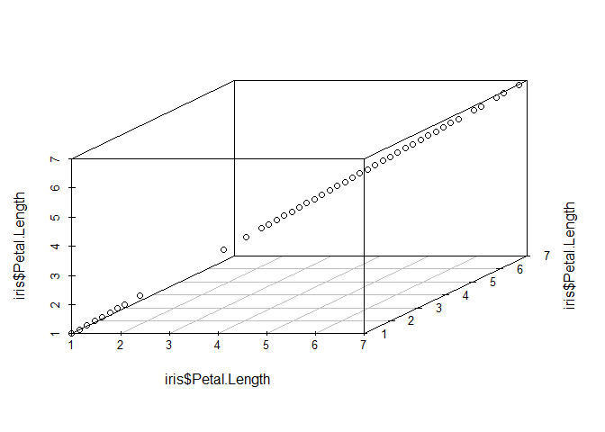

<br>

### Interactive 3D plot

Sekarang, kita akan membuat scatter plot 3D interaktif menggunakan
fungsi `plot_ly()` dari package PLOTLY

``` r
plot_ly(data = iris,
        x = ~Sepal.Length, y = ~Petal.Length, z = ~Petal.Width,
        color = ~Species,
        type = "scatter3d",
        mode = "markers") %>% 
  layout(
    scene = list(xaxis = list(title = 'Sepal length'),
                 yaxis = list(title = 'Petal length'),
                 zaxis = list(title = 'Petal width')))
```

<!--html_preserve-->

<div id="htmlwidget-4318ec1ef81bc067eed1" class="plotly html-widget" style="width:672px;height:480px;">

</div>

<script type="application/json" data-for="htmlwidget-4318ec1ef81bc067eed1">{"x":{"visdat":{"368077c166d1":["function () ","plotlyVisDat"]},"cur_data":"368077c166d1","attrs":{"368077c166d1":{"x":{},"y":{},"z":{},"mode":"markers","color":{},"alpha_stroke":1,"sizes":[10,100],"spans":[1,20],"type":"scatter3d"}},"layout":{"margin":{"b":40,"l":60,"t":25,"r":10},"scene":{"xaxis":{"title":"Sepal length"},"yaxis":{"title":"Petal length"},"zaxis":{"title":"Petal width"}},"hovermode":"closest","showlegend":true},"source":"A","config":{"showSendToCloud":false},"data":[{"x":[5.1,4.9,4.7,4.6,5,5.4,4.6,5,4.4,4.9,5.4,4.8,4.8,4.3,5.8,5.7,5.4,5.1,5.7,5.1,5.4,5.1,4.6,5.1,4.8,5,5,5.2,5.2,4.7,4.8,5.4,5.2,5.5,4.9,5,5.5,4.9,4.4,5.1,5,4.5,4.4,5,5.1,4.8,5.1,4.6,5.3,5],"y":[1.4,1.4,1.3,1.5,1.4,1.7,1.4,1.5,1.4,1.5,1.5,1.6,1.4,1.1,1.2,1.5,1.3,1.4,1.7,1.5,1.7,1.5,1,1.7,1.9,1.6,1.6,1.5,1.4,1.6,1.6,1.5,1.5,1.4,1.5,1.2,1.3,1.4,1.3,1.5,1.3,1.3,1.3,1.6,1.9,1.4,1.6,1.4,1.5,1.4],"z":[0.2,0.2,0.2,0.2,0.2,0.4,0.3,0.2,0.2,0.1,0.2,0.2,0.1,0.1,0.2,0.4,0.4,0.3,0.3,0.3,0.2,0.4,0.2,0.5,0.2,0.2,0.4,0.2,0.2,0.2,0.2,0.4,0.1,0.2,0.2,0.2,0.2,0.1,0.2,0.2,0.3,0.3,0.2,0.6,0.4,0.3,0.2,0.2,0.2,0.2],"mode":"markers","type":"scatter3d","name":"setosa","marker":{"color":"rgba(102,194,165,1)","line":{"color":"rgba(102,194,165,1)"}},"textfont":{"color":"rgba(102,194,165,1)"},"error_y":{"color":"rgba(102,194,165,1)"},"error_x":{"color":"rgba(102,194,165,1)"},"line":{"color":"rgba(102,194,165,1)"},"frame":null},{"x":[7,6.4,6.9,5.5,6.5,5.7,6.3,4.9,6.6,5.2,5,5.9,6,6.1,5.6,6.7,5.6,5.8,6.2,5.6,5.9,6.1,6.3,6.1,6.4,6.6,6.8,6.7,6,5.7,5.5,5.5,5.8,6,5.4,6,6.7,6.3,5.6,5.5,5.5,6.1,5.8,5,5.6,5.7,5.7,6.2,5.1,5.7],"y":[4.7,4.5,4.9,4,4.6,4.5,4.7,3.3,4.6,3.9,3.5,4.2,4,4.7,3.6,4.4,4.5,4.1,4.5,3.9,4.8,4,4.9,4.7,4.3,4.4,4.8,5,4.5,3.5,3.8,3.7,3.9,5.1,4.5,4.5,4.7,4.4,4.1,4,4.4,4.6,4,3.3,4.2,4.2,4.2,4.3,3,4.1],"z":[1.4,1.5,1.5,1.3,1.5,1.3,1.6,1,1.3,1.4,1,1.5,1,1.4,1.3,1.4,1.5,1,1.5,1.1,1.8,1.3,1.5,1.2,1.3,1.4,1.4,1.7,1.5,1,1.1,1,1.2,1.6,1.5,1.6,1.5,1.3,1.3,1.3,1.2,1.4,1.2,1,1.3,1.2,1.3,1.3,1.1,1.3],"mode":"markers","type":"scatter3d","name":"versicolor","marker":{"color":"rgba(252,141,98,1)","line":{"color":"rgba(252,141,98,1)"}},"textfont":{"color":"rgba(252,141,98,1)"},"error_y":{"color":"rgba(252,141,98,1)"},"error_x":{"color":"rgba(252,141,98,1)"},"line":{"color":"rgba(252,141,98,1)"},"frame":null},{"x":[6.3,5.8,7.1,6.3,6.5,7.6,4.9,7.3,6.7,7.2,6.5,6.4,6.8,5.7,5.8,6.4,6.5,7.7,7.7,6,6.9,5.6,7.7,6.3,6.7,7.2,6.2,6.1,6.4,7.2,7.4,7.9,6.4,6.3,6.1,7.7,6.3,6.4,6,6.9,6.7,6.9,5.8,6.8,6.7,6.7,6.3,6.5,6.2,5.9],"y":[6,5.1,5.9,5.6,5.8,6.6,4.5,6.3,5.8,6.1,5.1,5.3,5.5,5,5.1,5.3,5.5,6.7,6.9,5,5.7,4.9,6.7,4.9,5.7,6,4.8,4.9,5.6,5.8,6.1,6.4,5.6,5.1,5.6,6.1,5.6,5.5,4.8,5.4,5.6,5.1,5.1,5.9,5.7,5.2,5,5.2,5.4,5.1],"z":[2.5,1.9,2.1,1.8,2.2,2.1,1.7,1.8,1.8,2.5,2,1.9,2.1,2,2.4,2.3,1.8,2.2,2.3,1.5,2.3,2,2,1.8,2.1,1.8,1.8,1.8,2.1,1.6,1.9,2,2.2,1.5,1.4,2.3,2.4,1.8,1.8,2.1,2.4,2.3,1.9,2.3,2.5,2.3,1.9,2,2.3,1.8],"mode":"markers","type":"scatter3d","name":"virginica","marker":{"color":"rgba(141,160,203,1)","line":{"color":"rgba(141,160,203,1)"}},"textfont":{"color":"rgba(141,160,203,1)"},"error_y":{"color":"rgba(141,160,203,1)"},"error_x":{"color":"rgba(141,160,203,1)"},"line":{"color":"rgba(141,160,203,1)"},"frame":null}],"highlight":{"on":"plotly_click","persistent":false,"dynamic":false,"selectize":false,"opacityDim":0.2,"selected":{"opacity":1},"debounce":0},"shinyEvents":["plotly_hover","plotly_click","plotly_selected","plotly_relayout","plotly_brushed","plotly_brushing","plotly_clickannotation","plotly_doubleclick","plotly_deselect","plotly_afterplot","plotly_sunburstclick"],"base_url":"https://plot.ly"},"evals":[],"jsHooks":[]}</script>

<!--/html_preserve-->

Plot di atas sangat membantu dalam menunjukkan di mana species iris
terletak dalam 3 variabel yang diuji, membuatnya sangat mudah untuk
mengenali di mana mereka dikelompokkan.

<br>

### Heatmap

Heatmap chart menyajikan tampilan 2D dari matriks data. Untuk membuat
visualisasi ini kita menggunakan heatmap() command. Pertama kita akan
membuat matrix dari data iris dan menyimpannya sebagai data baru
menggunakan funsgi as.matrix() dan menghitung keserupaan antara bunga
yang berbeda menggunakan dist() command.

``` r
dist_matrix <- as.matrix(dist(iris[,1:4]))
heatmap(dist_matrix)
```

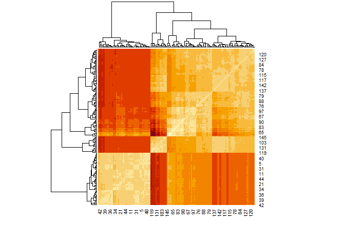

### Sepal width

**Boxplot sepal width:**

``` r
iris %>% # data yang digunakan 
  ggplot(
    aes(x = Species, #Axis x 
        y = Sepal.Width, #Axis y 
        fill = Species)) + #Isian box
  geom_boxplot() + #Menyuruh ggplot untuk menyiapkan boxplot
  scale_fill_brewer(palette = 'Dark2') + #Mengubah warna boxplot
  theme_light() + #Tema background putih 
  labs(title = "Boxplot dari sepal width ~ spesies",
       x = "Species",
       y = "Sepal width") #Label x dan y axis atau nama dari boxplot
```

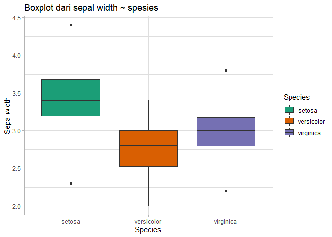

Dari boxplot ini dapat dilihat bahwa species *setosa* memiliki median
sepal width dan interquartile range yang tinggi dibandingkan dua spesies
lain. Di lain sisi, spesies Varsicolor dan Virginica menunjukkan sedikit
overlap antara satu dengan lainnya dalam interquartile range. Ini akan
menyulitkan algoritma machine learning untuk membedakan antara dua level
spesies ketika melakukan prediksi menggunakan variabel.

<br>

### Sepal length

(Untuk penjelasan mendetail tentang cara membuat boxplot, periksa tab
ketiga.)

**Boxplot sepal length**

``` r
iris %>%  
  ggplot(aes(x = Species, 
             y = Sepal.Length, 
             fill = Species))  +  
  geom_boxplot() + 
  scale_fill_brewer(palette = "Dark2") + 
  theme_light() +  
  labs(title = "Boxplot sepal length ~ species", 
       x = "Species",
       y = "Sepal length")  
```

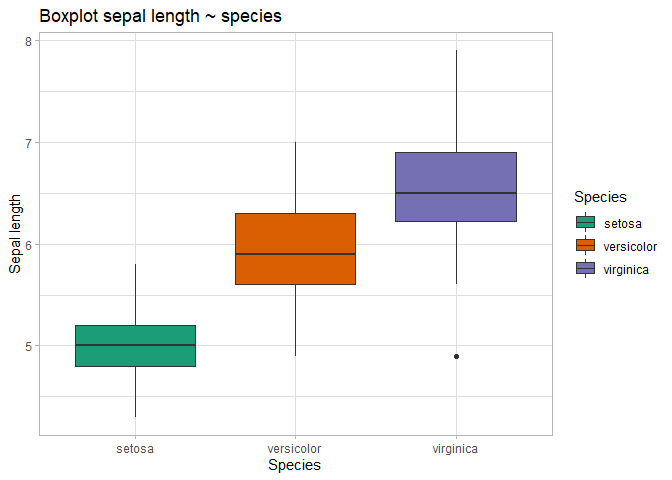

Range antara ketiga spesies dalam variable *sepal length* tampaknya
overlap (tumpang tindih). Namun, mediannya tampak sedikit berbeda
(setidaknya seara visual. Kita dapat menguji signifikansi median ini,
tapi kali ini tidak dilakukan).

<br>

### Petal width

(Untuk penjelasan mendetail tentang cara membuat boxplot, periksa tab
ketiga.)

**Boxplot petal width**

``` r
iris %>% 
  ggplot(aes(x = Species, 
         y = Petal.Width, 
         fill = Species)) +
  geom_boxplot() +
  scale_fill_brewer(palette = "Dark2") +
  theme_light() +
  labs(title = "Boxplot petal width ~ species",
       x = "Species",
       y = "Petal width")
```

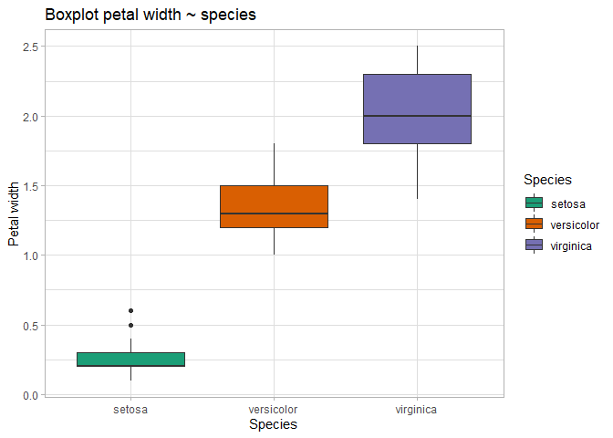

Boxplot di atas mengindikasikan perbedaan yang cukup nyata untuk
masing-masing spesies dalam variabel petal width

<br>

### Petal length

(Untuk penjelasan mendetail tentang cara membuat boxplot, periksa tab
ketiga.)

**Boxplot petal length**

``` r
iris %>% 
  ggplot(aes(x = Species, 
             y = Petal.Length, 
             fill = Species)) +
  geom_boxplot() +
  scale_fill_brewer(palette = "Dark2") +
  theme_light() +
  labs(title = "Boxplot petal length ~ species",
       x = "Species", 
       y = "Petal length")
```

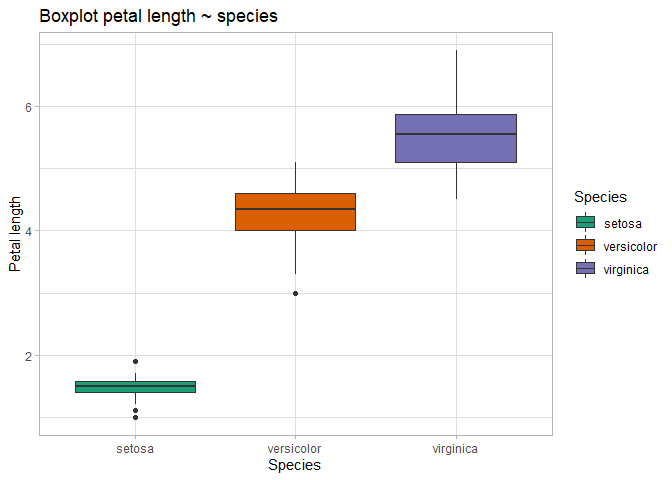

Plot ini tampaknya menunjukkan bahwa ketiga spesies bervariasi dalam
rentang interkuartil pada petal length. Setosa tampaknya memiliki range
interquartile yang sempit dan memiliki petal length yang lebih ppendek
dibandingkan dua spesies lainnya.

<br>

# Data partitioning

Sebelum memulai pelatihan model machine learning, kita harus membagi
data yang ada menjadi duat: train dan test. Dataset train akan digunakan
untuk “melatih” atau mengajari model machine learning untuk membuat
prediksi menggunakan data yang ada, sedangkan dataset test digunakan
untuk menguji model pada data yang belum terlihat untuk mengetahui
performanya.

Pertama, mari kita melakukan set seed. Ini memastikan bahwa kita akan
dapat mereplikasi hasil ketika menjalankan kembali analisis.

``` r
set.seed(12345)
```

Selanjutnya, kita akan membuat train/test partition menggunakan
`createDataPartition()` dari package CARET. Ini akan memisahkan data
kita secara random sampling dengan level species dan memberikan kita
sample
index.

``` r
train_index <- createDataPartition(y = iris$Species, # y = variabel dependent 
                                   p = .7, # Spesifikasi split menjadi 70% dan 30%
                                   list = FALSE, # Menjadikan hasil menjadi bentuk matrix
                                   times = 1) # Hanya sekali menentukan set partitions 
```

Sekarang kita dapat memisahkan data kita menjadi train dan test
menggunakan ‘train\_index’ random sample yang telah kita buat.

``` r
train_data <- iris[train_index,]
test_data <- iris[-train_index,]
```

<br>

# Machine Learning

Saatnya membuat pemodelan machine learning untuk memprediksi kategori
spesies mana (setosa, versicolor, virginica) milik masing-masing bunga
iris. Kita akan melakukan ***supervised*** machine learning; di mana
sudah terdapat data untuk dilatih, dan terdapat variabel yang
ditargetkan (spesies). Kebalikan dari metode ini adalah
***unsupervised*** learning, di mana mesin tidak diberikan data train
(biasanya data yang digunakan untuk metode ini adalah data tak
terstruktur). Karena kita menggunakan metode supervised learning, maka
algoritma yang akan dijalankan adalah ***clasifiers***, yang berarti
algoritma tersebut memprediksi *kategori* mana dari species tersebut.
Kebalikannya adalah *regresi* di mana seseorang memprediksi variabel
kontinu.

Untuk memudahkan dan menyederhanakan pekerjaan ini, model dipisahkan
menjadi beberapa tab independen sehingga pambaca dapat memilih tab mana
saja yang ingin dilihat.

## **Decision tree**

Kita akan menuliskan algoritma machine learning untuk memprediksi
Species dari dataset iris. Pada bagian ini, kita akan melakukan analisis
Decision Tree menggunakan dua cara.

Pertama akan dilakukan menggunakan package caret dan yang kedua
menggunakan package party.

Jika ingin memahami teori di balik algoritma decision tree lebih dahulu,
kalian bisa mencari penjelasnnya di internet. Saya merekomendasikan
menonton video singkat dari channel [StatQuest
ini](https://www.youtube.com/watch?v=_L39rN6gz7Y&ab_channel=StatQuestwithJoshStarmer)
atau [yang
ini](https://www.youtube.com/watch?v=7VeUPuFGJHk&ab_channel=StatQuestwithJoshStarmer).

Saya sendiri lebih suka menonton penjelasan dari video-video StatQuest
karena penjelasannya yang mudah dipahami oleh pemula dan awam.

<font size = "4"> **Sekilas info:** </font>

  - **Kegunaan:** Klasifikasi dan regresi
  - **Cara kerja:** Decision tree menggunakan input variabel untuk
    membuat cabang keputusan yang menghasilkan prediksi
  - **Plus:** (1) Mudah diinterpretasi, (2) Dapat menangani baik data
    numeric atau categoric, (3) Bagus dalam menangani outlier, (4) Tidak
    perlu memiliki asumsi tentang data (misalnya, distribusi data)
  - **Minus:** (1) Dapat overfit train data, (2) Rentan terhadap varians
    sehingga perbedaan input yang kecil dapat menghasilkan model predksi
    yang
berbeda

<div class="figure" style="text-align: center">


<p class="caption">

**<br>Figure 1:** Visualisasi model decision tree. <br> **Image
source:**
[Link](https://medium.com/greyatom/decision-trees-a-simple-way-to-visualize-a-decision-dc506a403aeb)

</p>

</div>

<br>

Pemodelan decision tree dengan 10 fold cross validation

``` r
# menggunakan caret
fitControl <- trainControl(method = "cv", number = 10, savePredictions = TRUE)
```

Membuat prediktor model dengan fungsi `train()` dari package CARET.
Tentukan `method = 'rpart'` untuk menjalankan model decision tree.

``` r
# Membuat model - caret 
dt_model <-  train(Species ~ .,
                   data = train_data,
                   method = "rpart",
                   trControl = fitControl)
```

Periksa akurasi yang diprediksi dari model decision tree dengan
menjalankannya pada train data. Nanti kita akan menguji keakuratan model
dengan menjalankan prediksi pada data test.

``` r
# caret 
confusionMatrix(dt_model)
```

    ## Cross-Validated (10 fold) Confusion Matrix 
    ## 
    ## (entries are percentual average cell counts across resamples)
    ##  
    ##             Reference
    ## Prediction   setosa versicolor virginica
    ##   setosa       33.3        0.0       0.0
    ##   versicolor    0.0       33.3       2.9
    ##   virginica     0.0        0.0      30.5
    ##                             
    ##  Accuracy (average) : 0.9714

Hasil ini menunjukkan bahwa akurasi rata-rata (average accuracy) adalah
97.14% saat menguji saat menguji ulang data train. Kita juga dapat
melihat apa yang diprediksi dengan benar/salah.

Memeriksa pentingnya setiap fitrur dalam model

``` r
# Membuat object of importance dari variabel - caret
dt_importance <- varImp(dt_model)

# Membuat plot dari variabel penting 
dt_importance %>% 
  ggplot(aes(x = dt_importance[,1])) +
  geom_boxplot() +
  labs(title = "Variable importance: Decision tree model") +
  theme_light()
```

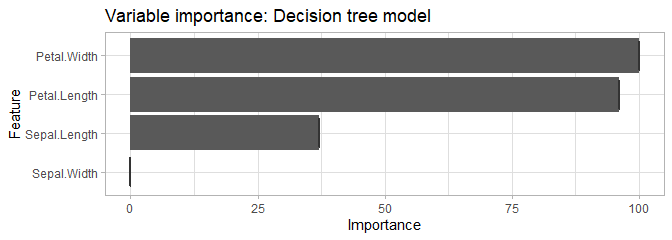

Tabel ini memberi kita gambaran yang sangat informatif tentang
pentingnya setiap variabel dalam memprediksi spesies.

Sekarang, mari kita membuat plot decision tree menggunakan
`fancyRpartPlot()` dari package RATTLE. Ini akan memberikan kita insight
yang jelas tentang bagaimana mode membuat prediksi.

``` r
# rattle 
fancyRpartPlot(dt_model$finalModel, sub = '')
```

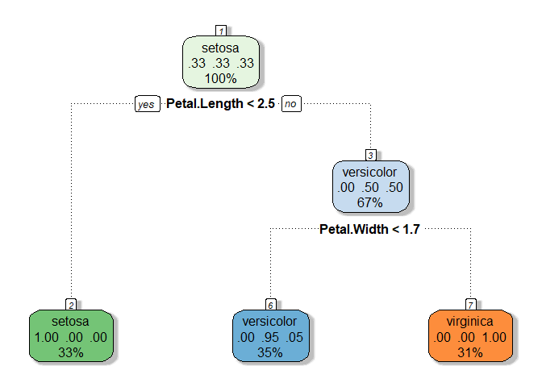

Decision tree ini menunjukkan bahwa:

  - Jika petal length lebih kecil dari 2.5, prediksinya adalah *setosa*
  - Jika petal length sama dengan atau lebih besar dari 2.5 dan jika
    petal width sama dengan atau lebih dari 1.7 maka masuk *virginica*
  - Jika petal length sama dengan atau lebih besar dari 2.5 dan jika
    petal width lebih kecil dari 1.7, maka prediksi masuk ke
    *versicolor*

Dalam kasus ini, dibutuhkan 2 variabel yaitu petal length dan petal
width untuk membuat prediksi

#### PREDICTION: Decision tree model

Menggunakan `dt_model` untuk menjalankan prediksi pada data test.

``` r
# stats 
prediction_dt <- predict(dt_model, test_data)
```

Memeriksa proporsi prediksi yang akurat

``` r
table(prediction_dt, test_data$Species) %>% # Tabel prediksi
  prop.table() %>% # Convert values ke proporsi bukan jumlah
  round(2) # Pembulatan 
```

    ##              
    ## prediction_dt setosa versicolor virginica
    ##    setosa       0.33       0.00      0.00
    ##    versicolor   0.00       0.29      0.04
    ##    virginica    0.00       0.04      0.29

Seperti yang dapat dilihat, 92% klasifikasi spesies diprediksi dengan
benar.

<style>
div.blue {background-color:#e6f0ff; border-radius: 5px; padding: 20px;}
</style>

<div class="blue">

  - **Final accuracy of the Decision Tree model: 98%**

</div>

<br>

## **Decision Tree: 2**

Bagian ini sebenarnya sama dengan bagian sebelumnya. Hanya saja,
analisis decision tree di sini dilakukan menggunakan fungsi ctree() dari
package party. Variable Sepal.Length, Sepal.Width, Petal.Length, dan
Petal.Width, tetap akan digunakan untuk memprefiksi variable Species.
Pada package party, fungsi ctree() digunakan untuk membuat decision
tree, dan fungsi predict() digunakan untuk memprediksi data baru.

Sebelum melakukan modeling, kita akan memisahkan data iris menjadi dua
(seperti apa yang telah kita lakukan di bagian Data Partition) 70&
merupakan data training dan 30% data test.

``` r
set.seed(1234)
ind <- sample(2, nrow(iris), replace = TRUE, prob = c(0.7, 0.3))
trainData <- iris[ind==1,]
testData <- iris[ind==2,]
```

``` r
my_formula <- Species ~ Sepal.Length + Sepal.Width +Petal.Length + Petal.Width 
iris_ctree <-  ctree(my_formula, data = trainData)
table(predict(iris_ctree), trainData$Species)
```

    ##             
    ##              setosa versicolor virginica
    ##   setosa         40          0         0
    ##   versicolor      0         37         3
    ##   virginica       0          1        31

``` r
print(iris_ctree)
```

    ## 
    ##   Conditional inference tree with 4 terminal nodes
    ## 
    ## Response:  Species 
    ## Inputs:  Sepal.Length, Sepal.Width, Petal.Length, Petal.Width 
    ## Number of observations:  112 
    ## 
    ## 1) Petal.Length <= 1.9; criterion = 1, statistic = 104.643
    ##   2)*  weights = 40 
    ## 1) Petal.Length > 1.9
    ##   3) Petal.Width <= 1.7; criterion = 1, statistic = 48.939
    ##     4) Petal.Length <= 4.4; criterion = 0.974, statistic = 7.397
    ##       5)*  weights = 21 
    ##     4) Petal.Length > 4.4
    ##       6)*  weights = 19 
    ##   3) Petal.Width > 1.7
    ##     7)*  weights = 32

<br>

``` r
plot(iris_ctree)
```

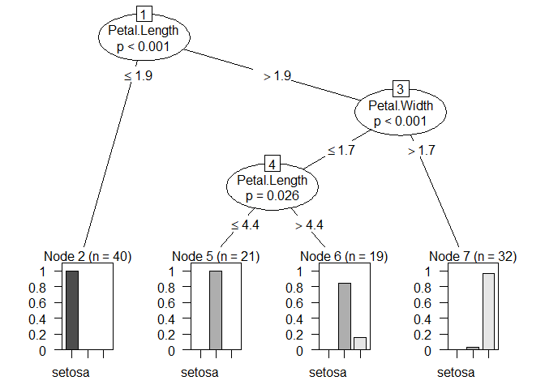

Barplot di atas menunjukkan klasifikasi spesies menggunakan variabe
dengan tipe data dbl.

Jika Petal.Length lebih kecil atau sama dengan 1.9, maka kemungkinan
akan termasuk dalam spesies setosa.

Jika Petal.Length lebih besar dari 1.9, kemungkinannya akan bercabang ke
Petal.Width.

Jika Petal.Length \> 1.9 dan Petal.Width \> 1.7, maka lebih besar
kemungkinannya akan masuk kategori spesies virginica.

Jika Petal.Width kurang atau sama dengan 1.7 dan petal length kurang
lebih atau sama dengan 4.4 maka kemungkinannya akan terklasifikasi ke
dalam kategori spesies
versicolor.

<br>

``` r
plot(iris_ctree, type="simple")
```

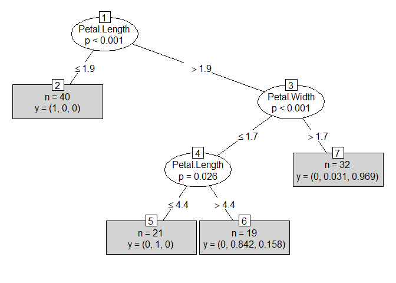

Chart di atas juga memiliki interpretasi yang sama dengan barplot
decision tree sebelumnya. Hanya saja untuk percabangannya diletakkan
sebagai “y” dalam masing-masing leaf (kotak prediksi itu disebut
daun/leaf karena ini decision tree). Sebagai contoh, node 2 memiliki
label "n=40, y=(1,0,0) yang berarti bahwa dalam klasifikasi tersebut
berisi 40 item dari data train dan semuanya termasuk dalam spesies
pertama / setosa.

Selanjutnya kita akan melakukan hal yang sama dengan testData untuk
menguji keajegan.

``` r
testPred <- predict(iris_ctree, newdata = testData)
table(testPred, testData$Species)
```

    ##             
    ## testPred     setosa versicolor virginica
    ##   setosa         10          0         0
    ##   versicolor      0         12         2
    ##   virginica       0          0        14

## **Random forest**

Pada bagian ini, pembuatan model menggunakan algoritma Random Forest
juga akan dibagi menjadi dua. Hal ini hanya untuk menunjukkan bagaiaman
sebuah analisis bisa dilakukan dengan berbagai cara di `R`.

Jika ingin memahami terlebih dahulu bagaimana algoritma random forest
bekerja atau teorinya, silahkan mencari penjen n vidie dari channel
StatQuest
[bagian 1](https://www.youtube.com/watch?v=J4Wdy0Wc_xQ&t=207s&ab_channel=StatQuestwithJoshStarmer),
[bagian 2](https://www.youtube.com/watch?v=nyxTdL_4Q-Q&ab_channel=StatQuestwithJoshStarmer),
atau tutorial membuat model random forest di R di
[sini](https://www.youtube.com/watch?v=6EXPYzbfLCE&ab_channel=StatQuestwithJoshStarmer)

<font size ="4"> **Sekilas info:** </font>

  - **Kegunaan:** Klasifikasi dan regresi
  - **Cara kerja:** Random forest bekerja dengan cara membuat banyak
    decision tree lalu menghitung rata-rata outpunya untuk mendapatkan
    prediksi. Untuk masalah klasifikasi rata-rata ini akan menjadi mode,
    sedangkan untuk masalah regresi ini akan menjadi mean.
  - **Plus:** (1) Bagus dalam menangani overfitting (karena penghitungan
    rata-rata dari decision tree yang banyak), (2) Baik dalam menangani
    outliers, (3) dapat menangani data numerik dan katergorikal, (4)
    fleksibel
  - **Minus:** (1) sulit diinterpretasikan, (2) memakan banyak waktu
    dibandingkan dengan beberapa model
lainnya.

<div class="figure" style="text-align: center">


<p class="caption">

**Figure 2:** Visualization of random forest model. <br> **Image
source:**
[Link](https://medium.com/@ar.ingenious/applying-random-forest-classification-machine-learning-algorithm-from-scratch-with-real-24ff198a1c57)

</p>

</div>

<br>

Membuat model latih (train) menggunakan `train()` dari package CARET

``` r
# Membuat model 
rf_model <- train(Species ~ ., # Variabel Y diikuti dengan "~." untuk memasukkan semua variabel dalam formula
                  method = "rf", # metode random forest 
                  trControl = fitControl, # Cross validation setting 
                  data = train_data) # Data yang digunakan
```

Use the `varImp()` function to grab the importance of each variable in
our random forest model and then plot them.

``` r
# Bikin object of importance dari variabel  
rf_importance <- varImp(rf_model)

# Membuat boxplotnya 
ggplot(data = rf_importance, mapping = aes(x = rf_importance[,1])) + # Data & mapping
  geom_boxplot() + # Create box plot
  labs(title = "Variable importance: Random forest model") + # Title
  theme_light() # Theme
```

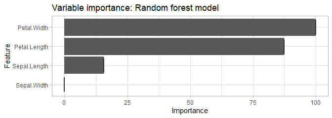

Plot di atas menunjukkan bahwa Petal Width dan Length adalah variabel
terpenting untuk prediksi dan model kita.

Sekarang, mari kita periksa akurasi yang diprediksi dari random forest
model dengan menjalankannya pada pada *train data* sample. Setelah itu,
kita akan menguji akurasi model dengan menjalankan prediksi pada *test
data*; data yang belum dilihat oleh model kita sebelumnya

``` r
confusionMatrix(rf_model)
```

    ## Cross-Validated (10 fold) Confusion Matrix 
    ## 
    ## (entries are percentual average cell counts across resamples)
    ##  
    ##             Reference
    ## Prediction   setosa versicolor virginica
    ##   setosa       33.3        0.0       0.0
    ##   versicolor    0.0       32.4       2.9
    ##   virginica     0.0        1.0      30.5
    ##                             
    ##  Accuracy (average) : 0.9619

Output di atas menunjukkan bahwa akurasi prediksi dari model adalah
96.19%. Selain itu, hasil di atas juga memberi kita matriks presentase
prediksi Species pada jawabannya.

#### Prediction: Random forest model

Kita akan menggunakan model random forest yang telah dibuat untuk
memprediksi spesies pada test data-data yang belum dilihat oleh ‘mesin’
sebelumnya.

Kita akan menggunakan `rf_model` yang dubuat untuk menjalankan prediksi
pada test data.

``` r
prediction_rf <- predict(rf_model, test_data)
```

Cek akurasi model random forest pada test data.

``` r
table(prediction_rf, test_data$Species) %>% 
  prop.table() %>% 
  round(2)
```

    ##              
    ## prediction_rf setosa versicolor virginica
    ##    setosa       0.33       0.00      0.00
    ##    versicolor   0.00       0.29      0.02
    ##    virginica    0.00       0.04      0.31

Kita dapat melihat bahwa akurasi dari random forest untukd test data
adalah 94%.

<div class="blue">

  - **Final accuracy of Random Forest model: 94%**

</div>

<br>

## **Random Forest 2**

Pada bagian kedua ini, kita akan membuat model dari dataset iris
menggunakan random forest dengan bantuan package randomForest.

Kita akan sekali lagi melakukan partisi data pada bagian ini.

``` r
ind_rf <- sample(2, nrow(iris), replace=TRUE, prob=c(0.7, 0.3))
ra_train_data <- iris[ind_rf==1,]
ra_test_data <- iris[ind_rf==2,]
ra_for <-  randomForest(Species ~ ., data=ra_train_data, ntree=100, proximity=TRUE)
table(predict(ra_for), ra_train_data$Species)
```

    ##             
    ##              setosa versicolor virginica
    ##   setosa         36          0         0
    ##   versicolor      0         26         3
    ##   virginica       0          3        36

<br>

``` r
print(ra_for)
```

    ## 
    ## Call:
    ##  randomForest(formula = Species ~ ., data = ra_train_data, ntree = 100,      proximity = TRUE) 
    ##                Type of random forest: classification
    ##                      Number of trees: 100
    ## No. of variables tried at each split: 2
    ## 
    ##         OOB estimate of  error rate: 5.77%
    ## Confusion matrix:
    ##            setosa versicolor virginica class.error
    ## setosa         36          0         0  0.00000000
    ## versicolor      0         26         3  0.10344828
    ## virginica       0          3        36  0.07692308

``` r
attributes(ra_for)
```

    ## $names
    ##  [1] "call"            "type"            "predicted"       "err.rate"       
    ##  [5] "confusion"       "votes"           "oob.times"       "classes"        
    ##  [9] "importance"      "importanceSD"    "localImportance" "proximity"      
    ## [13] "ntree"           "mtry"            "forest"          "y"              
    ## [17] "test"            "inbag"           "terms"          
    ## 
    ## $class
    ## [1] "randomForest.formula" "randomForest"

``` r
plot(ra_for)
```

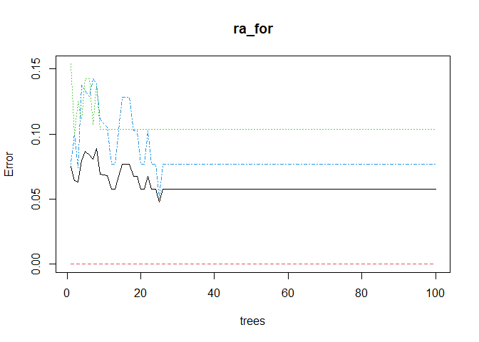

``` r
importance(ra_for)
```

    ##              MeanDecreaseGini
    ## Sepal.Length         7.267887
    ## Sepal.Width          1.554078
    ## Petal.Length        29.817828
    ## Petal.Width         29.525464

``` r
varImpPlot(ra_for)
```

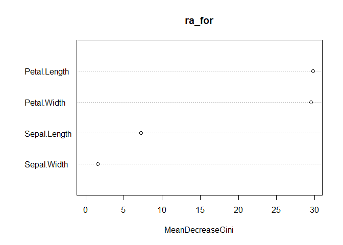

Mari kita prediksi menggunakan dataset ra\_test\_data.

``` r
iris_ra_pred<-predict(ra_for, newdata=ra_test_data)
table(iris_ra_pred,ra_test_data$Species)
```

    ##             
    ## iris_ra_pred setosa versicolor virginica
    ##   setosa         14          0         0
    ##   versicolor      0         20         1
    ##   virginica       0          1        10

``` r
plot(margin(ra_for, ra_test_data$Species))
```

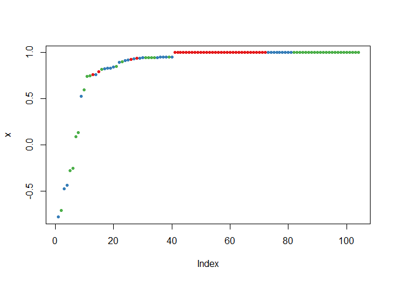

## **Naive Bayes**

Video penjelasan teori Naive Bayer dari
[Statquest](https://www.youtube.com/watch?v=O2L2Uv9pdDA&t=358s) atau
[Bayes
Theorem](https://www.youtube.com/watch?v=9wCnvr7Xw4E&ab_channel=StatQuestwithJoshStarmer)

<font size ="4"> **Quick facts:** </font>

  - **Kegunaan:** Klasifikasi
  - **Cara kerja:** Naive Bayes Model adalah algoritma klasifikasi
    sederhana berdasarkan teorema Bayes, yang secara *naive* berasumsi
    bahwa semua fitur yang dimasukkan ke dalamnya tidak bergantung satu
    sama lain dan sama pentingnya dalam memprediksi hasil. Terlepas dari
    kesederhanaannya, algoritma ini bisa lebih efektif daripada
    algoritma canggih lainnya
  - **Plus:** (1) Hanya membutuhkan sedikit data untuk dilatih, (2)
    berguna untuk data sets yang besar, (3) relatif cepat
  - **Minus:** (2) Mengasumsikan semua fitur independent dan setara,
    sesuatu yang biasanya tidak terjadi di kehidupan
nyata

<div class="figure" style="text-align: center">


<p class="caption">

**Figure 3:** Bayes’ theorem. <br> **Image source:**
[Link](https://medium.com/data-py-blog/naive-bayes-in-python-753f9140201)

</p>

</div>

<br>

Pemodelan Naive Bayes dengan 10 fold cross validation.

``` r
# Create model

nb_model <- train(Species ~ ., # Set y variable followed by '~'. The period indicates that we want to use all our variables for prediction.
                     data = train_data,
                     method = 'nb', # Specify Naive Bayes model
                     trControl = fitControl) # Use cross validation
```

Cek akurasi prediksi model dengan menjalankannya pada *train data*.
Setelah itu menguji akurasi model dengan menjalankan prediksi pada *test
data*.

``` r
confusionMatrix(nb_model)
```

    ## Cross-Validated (10 fold) Confusion Matrix 
    ## 
    ## (entries are percentual average cell counts across resamples)
    ##  
    ##             Reference
    ## Prediction   setosa versicolor virginica
    ##   setosa       33.3        0.0       0.0
    ##   versicolor    0.0       31.4       2.9
    ##   virginica     0.0        1.9      30.5
    ##                             
    ##  Accuracy (average) : 0.9524

Hasil di atas menunjukkan bahwa ketika menguji data menggunakan sample
train data, akurasi rata-ratanya adalah 96.19%. Kita juga dapat melihat
apa saja prediksi yang salah/benar.

Gunakan fungsi `varImp()` untuk memetakan importance dari masing-masing
variabel dalam model Naive Bayes kita lalu membuat plotnya.

``` r
# Create object of importance of our variables 
nb_importance <- varImp(nb_model) 

# Create box plot of importance of variables
ggplot(data = nb_importance, mapping = aes(x = nb_importance[,1])) + # Data & mapping
  geom_boxplot() + # Create box plot
  labs(title = "Variable importance: Naive Bayes model") + # Title
  theme_light() # Theme
```

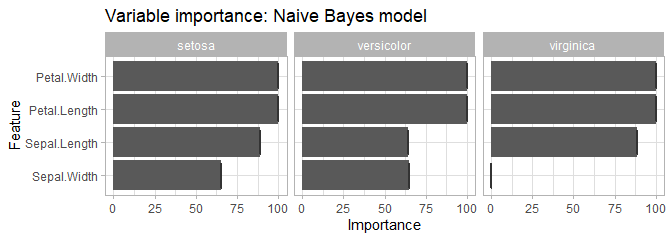

Tabel ini memberi kita gambaran yang sangat informatif tentang
pentingnya setiap variabel dalam memprediksi setiap spesies. Kita dapat
melihat bahwa Petal Length dan Petal Width adalah dua variabel
terpenting untuk memprediksi setiap spesies.

#### PREDICTION: Naive Bayes Model

Gunakan `nb_model` untuk menjalankan prediksi pada data test

``` r
prediction_nb <- predict(nb_model, test_data)
```

Cek proporsi akurasi model prediksi

``` r
table(prediction_nb, test_data$Species) %>% # table prediksi. 
  prop.table() %>% # Convert table values into proportions instead of counts. 
  round(2) # Bulatkan angka. 
```

    ##              
    ## prediction_nb setosa versicolor virginica
    ##    setosa       0.33       0.00      0.00
    ##    versicolor   0.00       0.29      0.02
    ##    virginica    0.00       0.04      0.31

Kita dapat melihat bahwa 94% klasifikasi spesies diprediksi dengan
benar.

<div class="blue">

  - **Final accuracy of Naive Bayes model: 94%**

</div>

<br>

## **Support Vector Machine (SVM)**

**Cooming Soon**
